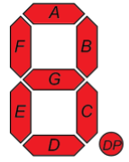
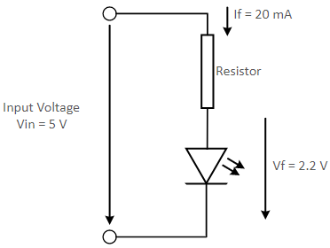
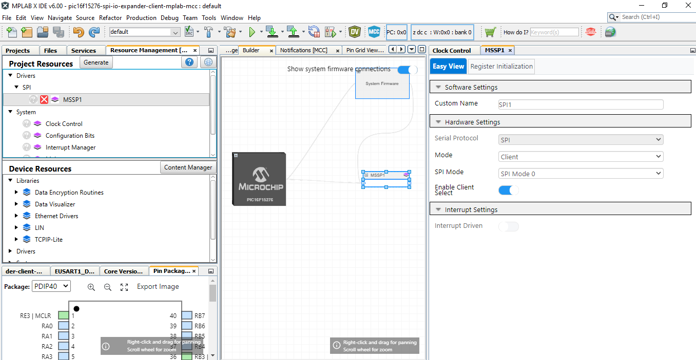
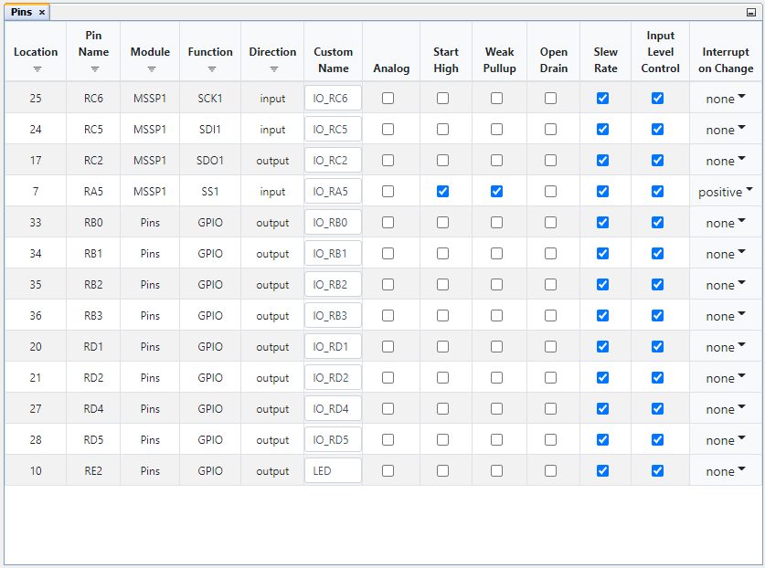

<!-- Please do not change this logo with link -->

# Client SPI I/O Expander using PIC16F15276 microcontroller

This code example highlights usage of PIC MCU as I/O expander, where the PIC16F15276 MCU acts as client and used as an I/O expander by host, and communicates through SPI interface. Compatible PIC16F152xx family of MCUs are:PIC16F15244,PIC16F15254,PIC16F15276.

Refer code example [Host SPI I/O Expander using PIC16F15276 microcontroller](https://github.com/microchip-pic-avr-examples/pic16f15276-cnano-spi-io-expander-host-mplab-mcc) for more details bout the host device implementation.

## Related Documentation

- [PIC16F15244 Product Family Page](https://www.microchip.com/en-us/products/microcontrollers-and-microprocessors/8-bit-mcus/pic-mcus/pic16f15244)
- [PIC16F15244 Code Examples on GitHub](https://github.com/microchip-pic-avr-examples?q=pic16f15244&type=&language=&sort=) 
- [PIC16F15244 MCU Family Video](https://www.youtube.com/watch?v=nHLv3Th-o-s)
- [PIC16F15244 MCU Product Page](https://www.microchip.com/en-us/product/PIC16F15244)
- [GitHub Microchip PIC Example : Client SPI I/O Expander using PIC16F15276 microcontroller]()
- [GitHub Microchip PIC Example : UART I/O Expander using PIC16F15276 microcontroller]()

## Seven Segment Display (SSD)

The 7-segment display consists of seven LEDs arranged in a rectangular fashion. Each of the seven LEDs is called a segment because when illuminated the segment forms part of a numerical to be displayed.

An additional 8th LED is sometimes used within the same package thus allowing the indication of a decimal point, (DP) when two or more 7-segment displays are connected to display numbers greater than ten.

Each one of the seven LEDs in the display is given a positional segment with one of its connection pins being brought straight out of the rectangular plastic package. These individual LED pins are labelled from a through to g representing each individual LED. The other LED pins are connected and wired to form a common pin. An additional 8th LED is sometimes used within the same package thus allowing the indication of a decimal point, (DP) when two or more 7-segment displays are connected to display numbers greater than ten.

  
   Figure 2 : SSD Segment Naming Conventions 

|Number| H G F E D C B A | Hexadecimal | 
|:---------:|:----------:|:-----------:|
| 0     | 11000000 | 0xC0 | 	
| 1     | 11111001 | 0xF9 |	
| 2     | 10100100 | 0xA4 |	
| 3     | 10110000 | 0xB0 |			
| 4     | 10011001 | 0x99 |
| 5     | 10010010 | 0x92 |
| 6	| 10000010 | 0x82 |
| 7	| 11111000 | 0xF8 |
| 8	| 10000000 | 0x80 |
| 9	| 10010000 | 0x90 |

### Resistor Value Calculation

If forward current (If) is 20 mA
If forward voltage (Vf) is 2.2 V
Input voltage (Vin) is 5 V

Resistor (R) = (Vin – Vf ) / ( If )

= 140 ohms

Note : 330 or 470 ohms resistor will be used.

  
   Figure 3 : SSD LED Resistor Driver Circuit 

## Software Tools

- [MPLAB® X IDE 6.0.0 or newer](http://www.microchip.com/mplab/mplab-x-ide)
- [MPLAB® XC8 2.35.0 or a newer compiler](http://www.microchip.com/mplab/compilers)
- [MPLAB® Code Configurator (MCC) 5.0.3 or newer](https://www.microchip.com/mplab/mplab-code-configurator)
- MCC Melody Core 2.1.9

**Note:** 

1. ***For running this demo, the installed tool version should be same or later. This example is not tested with the previous versions.***

## Hardware Tools

- Curiosity Nano Base for Click boards™[AC164162](https://www.microchip.com/en-us/development-tool/AC164162)
- PIC16F15276 Curiosity Nano Evaluation Kit [EV35F40A](https://www.microchip.com/en-us/development-tool/EV35F40A)
- PROTO1 XPLAINED PRO EXTENSION KIT [ATPROTO1-XPRO](https://www.microchip.com/en-us/development-tool/ATPROTO1-XPRO)

## Demo Operation

Refer GitHub code example [Host SPI I/O Expander using PIC16F15276 microcontroller](https://github.com/microchip-pic-avr-examples/pic16f15276-cnano-spi-io-expander-host-mplab-mcc) for more detials about the demo operation.

## Appendix

MCC – MPLAB® Code Configurator is a graphical programming environment that generates seamless, easy to understand C code to give a head start to the project, saving the designer’s time to initialize and configure all the modules, and to go through the datasheets. Using an instructive interface, it enables and configures all peripherals and functions specific to the application requirements.

## Start by creating a new Project and open MCC

*	Go to File > New Project
*	Select Microchip Embedded > Standalone Project
*	Enter the device name. In this case, select PIC16F15276 device
*	Name the project
*	Launch MCC tool by navigating to “Tools àEmbedded à MPLAB Code Configurator v4: Open/Close”. Alternatively, click the MCC icon to launch the MCC tool.

## System Configuration

## Configure Clock

Open "Clock Control" setup present under "System" dropdown menu in "Project Resources" tab. Host and the client device will be configured with same configuration as given below.

*	Set "Clock Source" as "HFINTOSC"
*	Set "HF Internal Clock" as "8_MHz"
*	Enable low power programming checkbox

The system configuration window of MCC is used for MCU oscillator, Watchdog timer and low voltage programming configuration. The Watchdog timer is disabled in the application.

The following figure shows the system configuration setting in MCC tool.

  

## MSSP Configuration

The below image explains about the client mssp configuration details in the project.

  

## Pin Mapping

The following images informs about the pin usage in the project.

1. Client Device:

  

