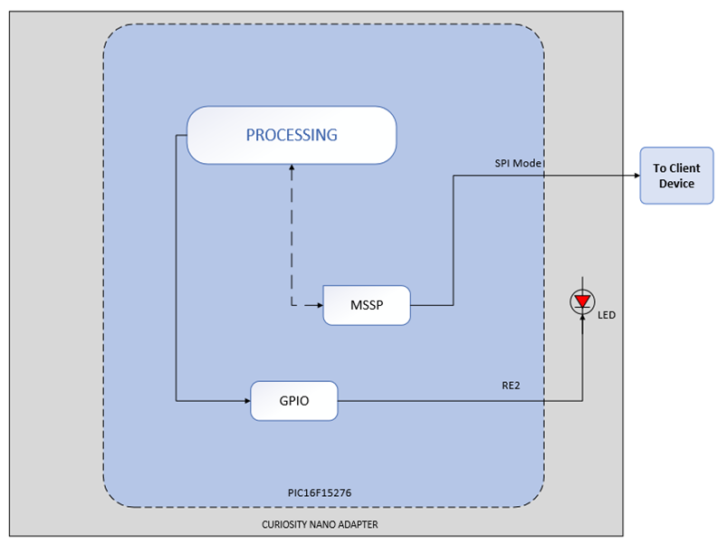

<!-- Please do not change this logo with link -->

# Client SPI I/O Expander using PIC16F15276 microcontroller

This code example demonstrates usage of PIC16F15276 microcontroller as a I/O expander in embedded applications, where the PIC16F15276 microcontroller provides additional I/O pins to the main microcontroller through serial communication interface like I2C or SPI or UART. In this code example, use of Master Synchronous Serial Port(MSSP) peripheral and GPIOs to realize SPI I/O expander is demonstrated.

This example highlights usage of PIC MCU as I/O expander, where the PIC16F15276 MCU acts as client and used as an I/O expander by host, and communicates through SPI interface. Compatible PIC16F152xx family of MCUs are:PIC16F15244,PIC16F15254,PIC16F15276

Refer code example Host SPI I/O Expander using PIC16F15276 microcontroller for more details bout the host device implementation.

## Introduction

The PIC16F15276 microcontroller is available in 40 pin packages for various embedded applications. The PIC16F15276 family’s simplified feature set includes Peripheral Pin Select (PPS), digital communication peripherals, timers, Enhanced Universal Synchronous Asynchronous Receiver Transmitter (EUSART), Master Synchronous Serial Port(MSSP). This code example demonstrates implementation of I/O Expander using MSSP(SPI mode) peripheral and I/O pins of the PIC16F15276 microcontroller.

The Serial Peripheral Interface (SPI) is a synchronous serial data communication bus that operates in Full-Duplex mode. Devices communicate in a host/client environment where the host device initiates the communication. A client device is selected for communication using the Client Select feature. The SPI bus specifies four signal connections:
1.	Serial Clock (SCK)
2.	Serial Data Out (SDO)
3. 	Serial Data In (SDI)
4.	Client Select (SS)

The SPI bus operates with a single host device and one or more client devices. When multiple client devices are used, an independent Client Select connection is required from the host device to each client device. The host selects only one client at a time. Most client devices have tri-state outputs, so their output signal appears disconnected from the bus when they are not selected.

## Related Documentation

- [PIC16F15244 Product Family Page](https://www.microchip.com/en-us/products/microcontrollers-and-microprocessors/8-bit-mcus/pic-mcus/pic16f15244)
- [PIC16F15244 Code Examples on GitHub](https://github.com/microchip-pic-avr-examples?q=pic16f15244&type=&language=&sort=) 
- [PIC16F15244 MCU Family Video](https://www.youtube.com/watch?v=nHLv3Th-o-s)
- [PIC16F15244 MCU Product Page](https://www.microchip.com/en-us/product/PIC16F15244)
- [GitHub Microchip PIC Example : Client SPI I/O Expander using PIC16F15276 microcontroller]()
- [GitHub Microchip PIC Example : UART I/O Expander using PIC16F15276 microcontroller]()

## Description

The Master Synchronous Serial Port (MSSP) module is a serial interface useful for communicating with other peripheral or microcontroller devices. These peripheral devices may be serial EEPROMs, Shift registers, display drivers, A/D converters, etc.

The MSSP module can operate in one of two modes:
*	Serial Peripheral Interface (SPI)
* 	Inter-Integrated Circuit (I2C)

The SPI interface can operate in Master or Slave mode and supports the following features:
* 	Selectable Clock Parity
* 	Slave Select Synchronization (Slave Mode Only)
* 	Daisy-Chain Connection of Slave Device

For the ease of demonstration, this code example uses PIC16F15276 microcontroller as host microcontroller and another PIC16F15276 microcontroller as client microcontroller. Also, the code example uses PIC16F15276 Curiosity nano development boards for the demonstration.

On host device, on-board switch of the PIC16F15276 Curiosity Nano board is used as a trigger to the host device to transfer command to the client device through SPI interface. The on-board LED is used to notify the user about successful switch press event detection and subsequent SPI command transmission by the host. After receiving the command from host, client device drives the respective I/O pins connected to the SSD in a pre-defined sequence, to display numbers from 0 to 3 in the ascending order.

  
   Figure 1 : Block diagram view of the application 

*	In this example, PIC16F15276 CNANO boards, PROTO Xplained Pro extension kit with SSD circuitry populated over it and few connecting jumper cables are used for demonstrating SPI I/O Expander.
*	The on-board switch of host device is used to initiate the communication between the host and client devices over SPI interface. The HLT mode of timer-2 module is used for switch debounce implementation.
*	The client receives the command from the host device over SPI interface.
* The client microcontroller verifies the commands upon reception, if it matches then initiates the number display from 0 to 3 on SSD. It is followed up with SSD value resetting to zero.

## Seven Segment Display (SSD)

The 7-segment display consists of seven LEDs arranged in a rectangular fashion. Each of the seven LEDs is called a segment because when illuminated the segment forms part of a numerical to be displayed.

An additional 8th LED is sometimes used within the same package thus allowing the indication of a decimal point, (DP) when two or more 7-segment displays are connected to display numbers greater than ten.

Each one of the seven LEDs in the display is given a positional segment with one of its connection pins being brought straight out of the rectangular plastic package. These individual LED pins are labelled from a through to g representing each individual LED. The other LED pins are connected and wired to form a common pin. An additional 8th LED is sometimes used within the same package thus allowing the indication of a decimal point, (DP) when two or more 7-segment displays are connected to display numbers greater than ten.

  
   Figure 2 : SSD Segment Naming Conventions 

|Number| H G F E D C B A | Hexadecimal | 
|:---------:|:----------:|:-----------:|
| 0     | 11000000 | 0xC0 | 	
| 1     | 11111001 | 0xF9 |	
| 2     | 10100100 | 0xA4 |	
| 3     | 10110000 | 0xB0 |			
| 4     | 10011001 | 0x99 |
| 5     | 10010010 | 0x92 |
| 6	| 10000010 | 0x82 |
| 7	| 11111000 | 0xF8 |
| 8	| 10000000 | 0x80 |
| 9	| 10010000 | 0x90 |

### Resistor Value Calculation

If forward current (If) is 20 mA
If forward voltage (Vf) is 2.2 V
Input voltage (Vin) is 5 V

Resistor (R) = (Vin – Vf ) / ( If )

= 140 ohms

Note : 330 or 470 ohms resistor will be used.

  
   Figure 3 : SSD LED Resistor Driver Circuit 

## Software Tools

- [MPLAB® X IDE 6.0.0 or newer](http://www.microchip.com/mplab/mplab-x-ide)
- [MPLAB® XC8 2.35.0 or a newer compiler](http://www.microchip.com/mplab/compilers)
- [MPLAB® Code Configurator (MCC) 5.0.3 or newer](https://www.microchip.com/mplab/mplab-code-configurator)
- MCC Melody Core 2.1.9

**Note:** 

1. ***For running this demo, the installed tool version should be same or later. This example is not tested with the previous versions.***

## Hardware Tools

- Curiosity Nano Base for Click boards™[AC164162](https://www.microchip.com/en-us/development-tool/AC164162)
- PIC16F15276 Curiosity Nano Evaluation Kit [EV35F40A](https://www.microchip.com/en-us/development-tool/EV35F40A)
- PROTO1 XPLAINED PRO EXTENSION KIT [ATPROTO1-XPRO](https://www.microchip.com/en-us/development-tool/ATPROTO1-XPRO)

## Application Firmware

This example is supplemented with two standalone firmware named as host firmware, client firmware.

The host firmware uses MSSP(SPI mode) peripheral for communication with client. Upon detection of a valid switch press event, the host sends a command to the client over SPI interface. Also, the host blinks on-board LED each time a command is successfully sent to the client.

The client firmware is comprised of two sections. First section is verifying the command received from the host through SPI interface. The second section consists of driving SSD, so the SSD start displaying digits from 0 to 3 in an incrementing order each time a valid command is received from the host. Additionally, the client firmware toggles on-board LED each time after a digit is displayed on the SSD and resets display value to zero when the cycle is completed.

## Appendix

MCC – MPLAB® Code Configurator is a graphical programming environment that generates seamless, easy to understand C code to give a head start to the project, saving the designer’s time to initialize and configure all the modules, and to go through the datasheets. Using an instructive interface, it enables and configures all peripherals and functions specific to the application requirements.

## Start by creating a new Project and open MCC

*	Go to File > New Project
*	Select Microchip Embedded > Standalone Project
*	Enter the device name. In this case, select PIC16F15276 device
*	Name the project
*	Launch MCC tool by navigating to “Tools àEmbedded à MPLAB Code Configurator v4: Open/Close”. Alternatively, click the MCC icon to launch the MCC tool.

## System Configuration

## Configure Clock

Open "Clock Control" setup present under "System" dropdown menu in "Project Resources" tab. Host and the client device will be configured with same configuration as given below.

*	Set "Clock Source" as "HFINTOSC"
*	Set "HF Internal Clock" as "8_MHz"
*	Enable low power programming checkbox

The system configuration window of MCC is used for MCU oscillator, Watchdog timer and low voltage programming configuration. The Watchdog timer is disabled in the application.

The following figure shows the system configuration setting in MCC tool.

  

## MSSP Configuration

The below image explains about the client mssp configuration details in the project.

  

## Pin Mapping

The following images informs about the pin usage in the project.

1. Client Device:

  

## Hardware Setup

The following figure consists of populated PROTO Xplained Pro extension kit, Curiosity Nano Adapter Board and PIC16F15276 Curiosity Nano Evaluation Kit (host and client devices). The figure shows the detailed information about the hardware setup. The populated PROTO Xplained Pro extension kit is interfaced with PIC16F15276 MCU using extension header of the curiosity nano adapter board.

  

## Operation

*	Make the hardware connections as shown in the Hardware Setup. Power up the Curiosity Nano board using micro-USB cable.

*	Download the firmware available from the GitHub code example page.

*	Build the project using latest version of tools as mentioned in the Software Tools section and flash the generated file on the PIC16F15276 MCU.

*	On host-side, onboard switch press event is performed to transmit the command to the client through SPI interface.

*	On host-side, onboard LED is used as an indicator for the switch press event and indicates command is sent to the client.

*	On client-side, after receiving the command from the host, client device verifies the command and drives the 7 segment LED display to display numbers from 0 to 3. On-board LED of CNANO board toggles for every number display.

## Conclusions

In many real-world embedded applications, the microcontroller requires to interface with multi-pin standalone IC modules and display units to perform various functionalities. So, the developers have a challenge in effectively using microcontrollers I/O pins for interfacing the external modules without opting an expensive, higher pin and memory variant. This code example demonstrates how cost effective and entry level PIC16F15726 microcontroller can be used as I/O expander using SPI interface
